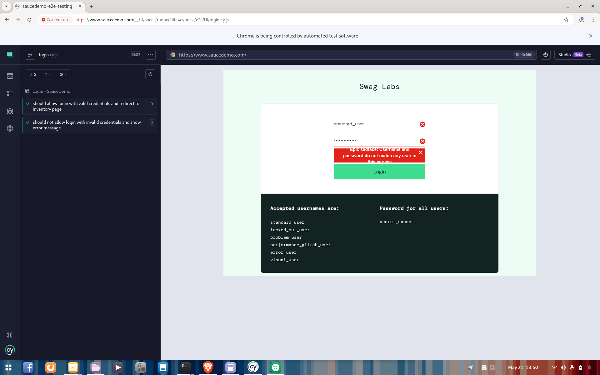

# SauceDemo E2E Testing


End-to-end testing practice project using Cypress with the SauceDemo web application.

## Project Objective

The goal of this project is to practice UI automation, functional testing, assertions, test organization, and QA analysis based on real user flows.

## Tested Scenarios

### UI Testing

- Valid login
- Invalid login
- Login error message validation
- Redirection to inventory page after successful login
- Inventory page visibility validation

## Project Structure

- `cypress/e2e/UI` → UI automated tests
- `cypress/e2e/API` → API testing scenarios
- `cypress/fixtures` → Test data
- `pages` → Page Object Model files
- `screenshots` → Test execution evidence

## Tools Used

- Cypress
- JavaScript
- Node.js
- Git
- GitHub

## Skills Demonstrated

- End-to-End Testing
- UI Automation
- Functional Testing
- Test Assertions
- Test Data Management
- Page Object Model
- QA Analysis
- Git/GitHub workflow

## Test Execution Evidence

### Cypress Login Tests



## How to Run the Project

Clone the repository:

```bash
git clone https://github.com/thiagoqueirozm/saucedemo-e2e-testing.git
```

Access the project folder:

```bash
cd saucedemo-e2e-testing
```

Install dependencies:

```bash
npm install
```

Open Cypress:

```bash
npx cypress open
```

Run the available test specs from the Cypress interface.

## Key Learnings

- Organizing automated tests with Cypress
- Using fixtures to manage test data
- Applying Page Object Model structure
- Validating successful and unsuccessful login flows
- Debugging Cypress path and fixture issues
- Using Git and GitHub to publish a QA portfolio project

## Author

Thiago Queiroz Meneses dos Santos
